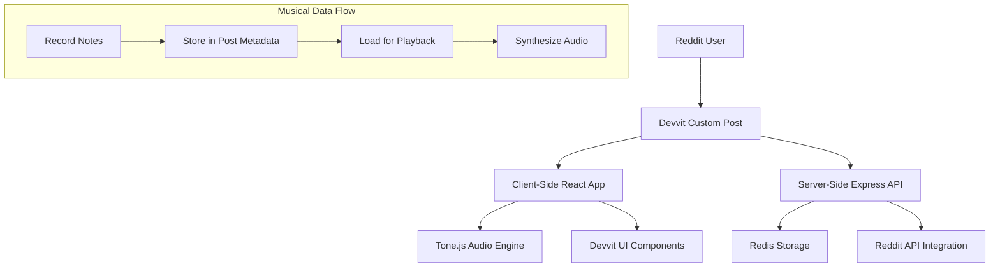

# Design Document

## Overview

Dhwani is a collaborative music creation app that leverages Reddit's threaded reply system as the foundation for asynchronous musical collaboration. The app transforms Reddit posts into interactive musical instruments and uses the natural threading structure to build layered compositions. Built on Devvit, it provides a seamless Reddit-native experience while enabling rich musical interaction through client-side audio synthesis.

## Architecture

### High-Level Architecture



### Component Architecture

The app follows Devvit's standard client-server architecture with specialized musical components:

- **Client (`src/client/`)**: React-based UI with Tone.js integration
- **Server (`src/server/`)**: Express API for Reddit integration and data persistence
- **Shared (`src/shared/`)**: Musical data types and interfaces

## Components and Interfaces

### Core Components

#### 1. Instrument Components

**DrumKit Component**

```typescript
interface DrumKitProps {
  onNotePlay: (drum: DrumType, velocity: number) => void;
  isRecording: boolean;
  activeNotes: Set<DrumType>;
}
```

**Piano Component**

```typescript
interface PianoProps {
  onNotePlay: (note: string, velocity: number) => void;
  isRecording: boolean;
  activeNotes: Set<string>;
  octave: number;
}
```

**Bass Component**

```typescript
interface BassProps {
  onNotePlay: (string: BassString, fret: number) => void;
  isRecording: boolean;
  selectedFret: number;
  activeNotes: Set<string>;
}
```

#### 2. Recording System

**AudioRecorder Component**

```typescript
interface AudioRecorderProps {
  instrument: InstrumentType;
  onRecordingComplete: (trackData: TrackData) => void;
  referenceTrack?: TrackData[];
}
```

**PlaybackEngine Component**

```typescript
interface PlaybackEngineProps {
  tracks: TrackData[];
  onPlaybackStateChange: (isPlaying: boolean) => void;
  visualFeedback: boolean;
}
```

#### 3. Reddit Integration Components

**RiffPost Component**

```typescript
interface RiffPostProps {
  postData: RedditPost;
  trackData: TrackData[];
  onJamRequest: () => void;
  onChallengeRequest: () => void;
}
```

**JamReply Component**

```typescript
interface JamReplyProps {
  parentTrackData: TrackData[];
  onReplySubmit: (newTrackData: TrackData) => void;
}
```

### Data Models

#### Musical Data Structure

```typescript
type TrackData = {
  id: string;
  instrument: InstrumentType;
  notes: NoteEvent[];
  tempo: number;
  duration: number;
  userId: string;
  timestamp: number;
};

type NoteEvent = {
  note: string;
  velocity: number;
  startTime: number;
  duration: number;
};

type CompositionData = {
  layers: TrackData[];
  metadata: {
    title?: string;
    collaborators: string[];
    createdAt: number;
    parentPostId?: string;
  };
};
```

#### Reddit Integration Types

```typescript
type DhwaniPost = {
  postId: string;
  compositionData: CompositionData;
  postType: 'riff' | 'jam_reply';
  parentPostId?: string;
};

type ChallengeScore = {
  userId: string;
  accuracy: number;
  timing: number;
  completedAt: number;
  originalTrackId: string;
};
```

## Audio Engine Design

### Tone.js Integration

The audio engine uses Tone.js for all synthesis and playback:

```typescript
class DhwaniAudioEngine {
  private synths: Map<InstrumentType, Tone.Synth>;
  private drumKit: Tone.Players;
  private bassGuitar: Tone.MonoSynth;

  async initializeInstruments(): Promise<void>;
  playNote(instrument: InstrumentType, note: string, velocity: number): void;
  playTrack(trackData: TrackData): Promise<void>;
  playComposition(composition: CompositionData): Promise<void>;
  startRecording(): void;
  stopRecording(): TrackData;
}
```

### Instrument Synthesis Configuration

- **Drums**: Tone.Players with sample-based sounds
- **Piano**: Tone.PolySynth with piano-like ADSR envelope
- **Bass**: Tone.MonoSynth with low-pass filtering and sub-bass emphasis

## Reddit Integration Strategy

### Custom Post Implementation

The app creates custom Reddit posts using Devvit's post creation API:

```typescript
// Server-side post creation
app.post('/api/create-riff', async (req, res) => {
  const { trackData, title } = req.body;

  const post = await reddit.submitPost({
    title: title || 'New Dhwani Riff',
    subredditName: context.subredditName,
    preview: generateRiffPreview(trackData),
    url: generateAppUrl(trackData.id),
  });

  await redis.set(`riff:${post.id}`, JSON.stringify(trackData));
  res.json({ postId: post.id });
});
```

### Threading for Musical Collaboration

Jam replies are implemented as Reddit comments with embedded musical data:

```typescript
// Server-side jam reply creation
app.post('/api/create-jam-reply', async (req, res) => {
  const { parentPostId, newTrackData, combinedComposition } = req.body;

  const comment = await reddit.submitComment({
    id: parentPostId,
    text: generateJamReplyText(newTrackData),
    // Musical data stored in Redis, referenced by comment ID
  });

  await redis.set(`jam:${comment.id}`, JSON.stringify(combinedComposition));
  res.json({ commentId: comment.id });
});
```

## Error Handling

### Audio System Error Handling

- **Browser Compatibility**: Graceful degradation for browsers without Web Audio API support
- **Audio Context Issues**: Automatic retry with user gesture requirement handling
- **Synthesis Failures**: Fallback to basic oscillator sounds if advanced synthesis fails

### Reddit Integration Error Handling

- **API Rate Limits**: Implement exponential backoff for Reddit API calls
- **Post Creation Failures**: Provide clear user feedback and retry mechanisms
- **Data Persistence Issues**: Local storage backup for unsaved musical data

### Network and Storage Error Handling

- **Redis Connection Issues**: Graceful degradation with local-only functionality
- **Large Data Payloads**: Compression and chunking for complex compositions
- **Concurrent Access**: Optimistic locking for collaborative editing scenarios

## Testing Strategy

### Unit Testing

- **Audio Engine Tests**: Mock Tone.js for testing musical logic without audio output
- **Component Tests**: React Testing Library for UI component behavior
- **Data Model Tests**: Validation and serialization of musical data structures

### Integration Testing

- **Reddit API Integration**: Test post and comment creation workflows
- **Audio Playback**: Automated testing of synthesis and playback timing
- **Cross-Browser Compatibility**: Testing across different Web Audio API implementations

### User Experience Testing

- **Musical Accuracy**: Timing precision tests for recording and playback
- **Collaborative Workflows**: End-to-end testing of jam session creation
- **Performance Testing**: Large composition playback and UI responsiveness

### Devvit Platform Testing

- **Custom Post Rendering**: Verify proper display within Reddit's interface
- **Playtest Environment**: Comprehensive testing using `npm run dev` workflow
- **Mobile Compatibility**: Touch interface testing for mobile Reddit users

## Performance Considerations

### Audio Performance

- **Lazy Loading**: Load instrument samples only when needed
- **Audio Context Management**: Proper cleanup to prevent memory leaks
- **Synthesis Optimization**: Limit concurrent voices to prevent audio dropouts

### Data Management

- **Composition Size Limits**: Implement reasonable limits for track length and complexity
- **Caching Strategy**: Client-side caching of frequently accessed compositions
- **Compression**: Efficient encoding of musical data for storage and transmission

### Reddit Integration Performance

- **Batch Operations**: Group multiple Reddit API calls where possible
- **Optimistic Updates**: Update UI immediately while background operations complete
- **Progressive Loading**: Load musical data incrementally for complex threads
